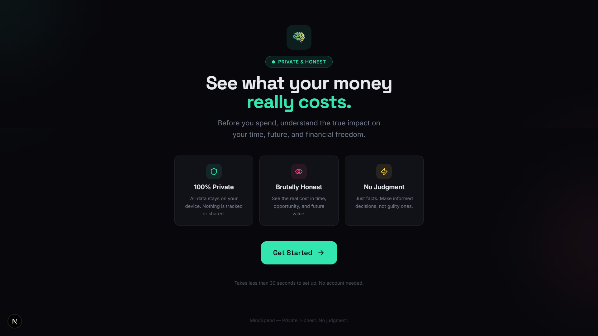
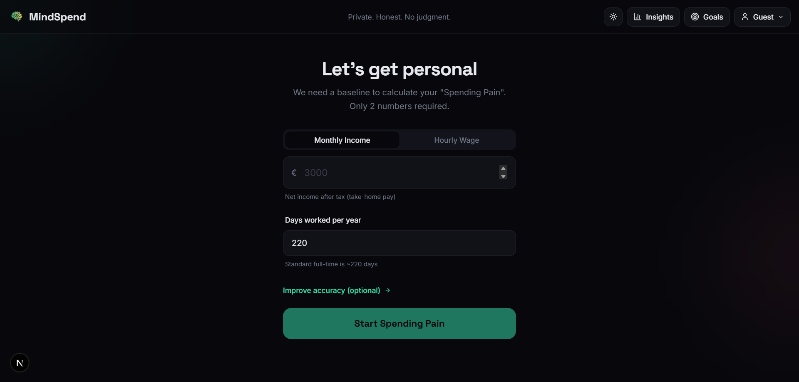
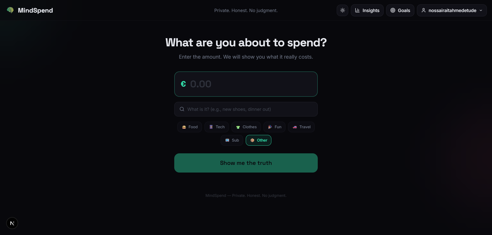
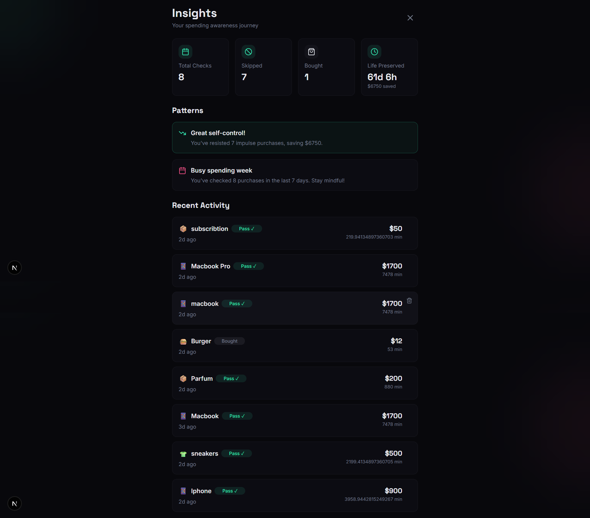
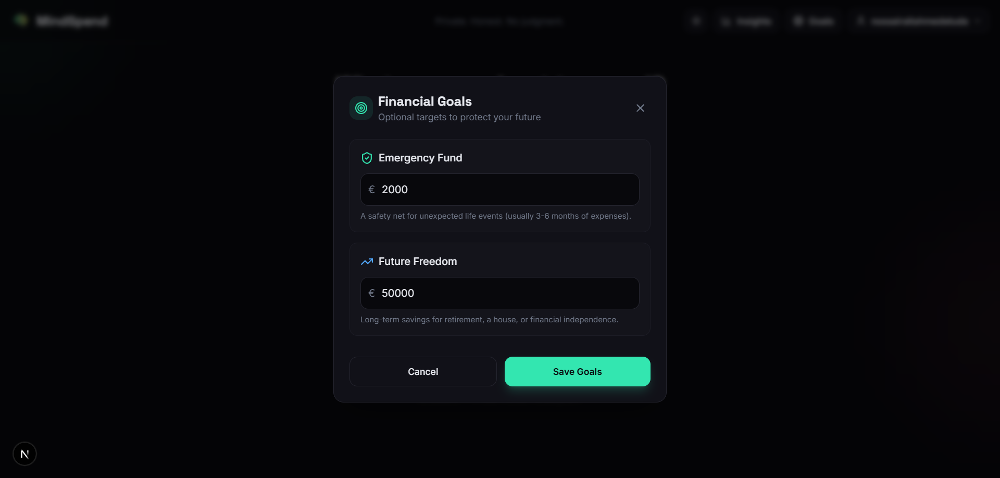

# MindSpend Web App


MindSpend is a web app that helps users make intentional purchase decisions by reframing spending as tradeoffs in time, opportunity cost, and long-term goals.

## Table of Contents

- [What this app does](#what-this-app-does)
- [Screenshots](#screenshots)
- [Tech stack](#tech-stack)
- [Project structure](#project-structure)
- [How it works](#how-it-works)
- [Getting started](#getting-started)
- [Available scripts](#available-scripts)


## What this app does

- Converts purchase amounts into practical life-impact comparisons.
- Helps users slow down impulse buying with reflection prompts and cool-off flows.
- Tracks spending patterns and surfaces insights over time.
- Supports guest usage (local) and authenticated usage (cloud sync via Firebase).

## Screenshots

<p>
  
  
  
  
  
</p>

## Tech stack

### Core

- **Next.js 16 (App Router):** routing, layouts, and app structure.
- **React 19 + TypeScript:** component-based UI with type safety.

### UI and UX

- **Tailwind CSS:** styling and layout.
- **Radix UI:** accessible primitives (wrapped in `components/ui`).
- **Recharts:** charts for insights and trend views.

### Data and auth

- **Firebase Auth:** user login/session handling.
- **Firestore:** synced purchase history and user data.

### Developer tooling

- **ESLint:** linting and code quality checks.
- **React Hook Form + Zod:** form state + validation.

## Project structure

```text
spending-pain-simulator/
  app/                # Next.js app entry (layout, page, global styles)
  components/         # Feature components + reusable UI blocks
    ui/               # Shared UI primitives (buttons, dialogs, etc.)
  hooks/              # Reusable React hooks
  lib/                # Core logic (auth, firebase, purchase history, utils)
  public/             # Static assets (logo + README screenshots)
    screenshots/      # Product images used in this README
  .env.example        # Required environment variable template
  README.md           # Project documentation
```

## How it works

- The app starts in `app/page.tsx`, which controls the full user flow (`welcome -> setup -> price -> cooloff -> results -> insights`).
- Auth and profile state are managed by `lib/auth-context.tsx` (Google/email auth, guest mode, profile loading/saving).
- Firebase is initialized in `lib/firebase.ts`; authenticated data is read/written through Firestore.
- Purchase events and history logic live in `lib/purchase-history.ts` (save, fetch, update decision, guest fallback).
- UI is split by feature in `components/` so each screen stays focused and easy to maintain.
- Shared building blocks are in `components/ui`, while business rules stay in `lib`.

## Getting started

1. Install dependencies:

```bash
npm install
```

2. Create your environment file from the template:

- macOS / Linux:

```bash
cp .env.example .env.local
```

- Windows (PowerShell):

```powershell
Copy-Item .env.example .env.local
```

3. Fill in Firebase values in `.env.local`.

4. Start the development server:

```bash
npm run dev
```

5. Open `http://localhost:3000` in your browser.

## Available scripts

- `npm run dev` - Start local development server.
- `npm run build` - Build production bundle.
- `npm run start` - Run production server.
- `npm run lint` - Run ESLint checks.
